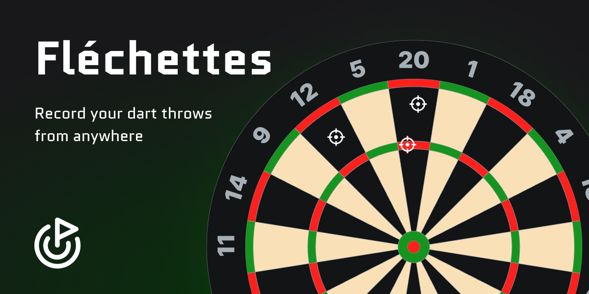
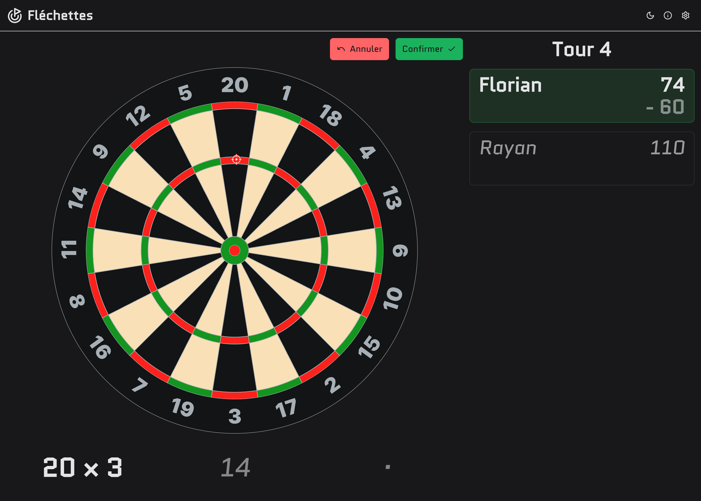
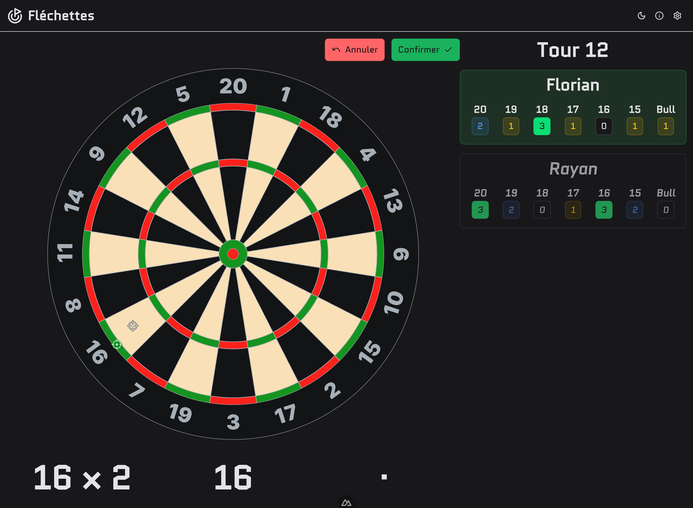

# Fléchettes

Fléchettes is a web application to record dart games. It can record games of various types, including 301, 501, and cricket.

You can register each throw by clicking on the dartboard, then the application will calculate the score and update the game state.

## Double Out

The Double Out is a game mode where you must finish the game by reaching zero from 301 or 501.
In the original rules, your last throw needs to be a double (double segment on the dartboard), but currently, the application does not check if the last throw is a double.

## Cricket

The Cricket game mode is a popular variant of darts where players aim to hit specific numbers (15-20 and the bullseye) three times to "close" them.
The first player to close all numbers wins the game.

